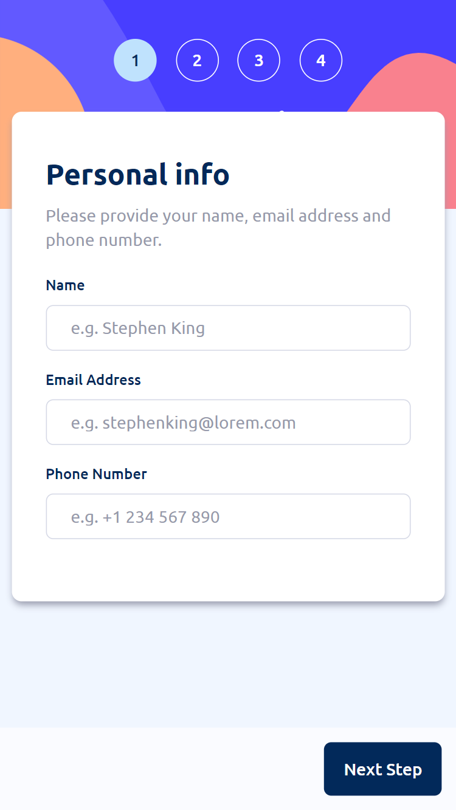
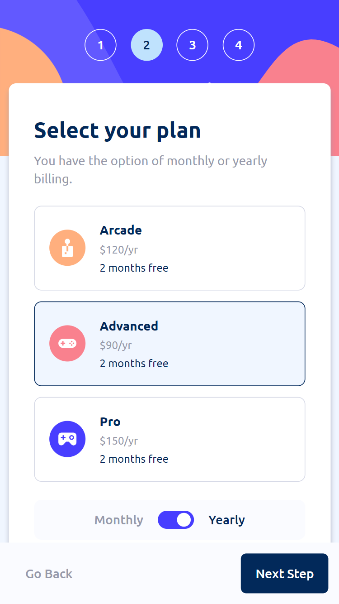
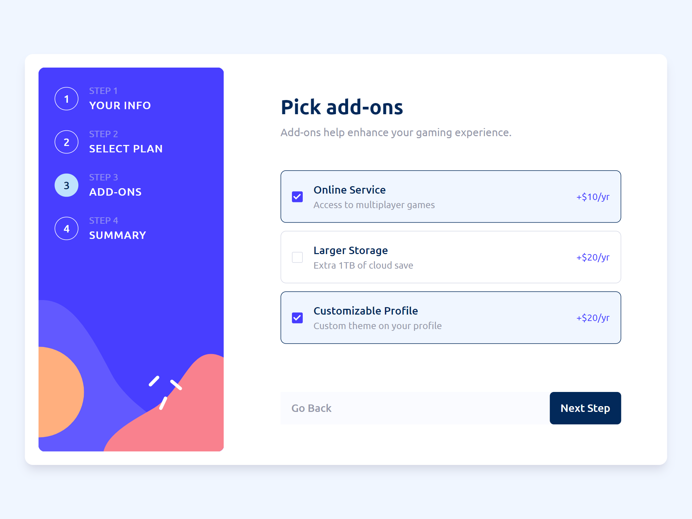
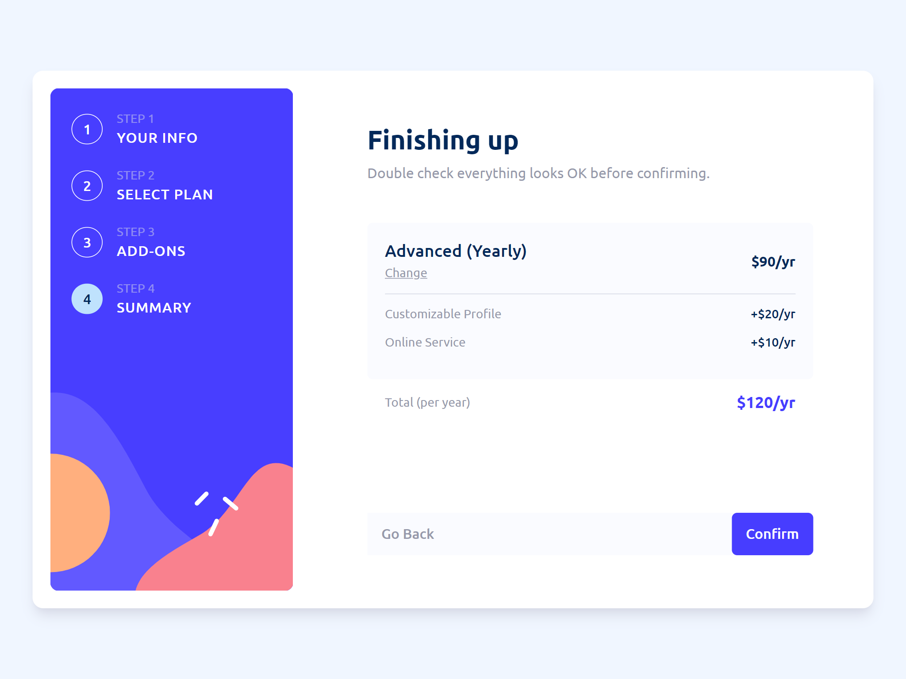

# Frontend Mentor - Multi-step form solution

Hi there!

Firstly, thank you for taking your time to review my project.

This is a solution to the [Multi-step form challenge on Frontend Mentor](https://www.frontendmentor.io/challenges/multistep-form-YVAnSdqQBJ).

## Table of contents

- [Overview](#overview)
- [Screenshots](#screenshot)
- [Built with](#built-with)

## Overview

Users are be able to:

- Complete each step of the form sequence.
- Go back to a previous step to update their selections.
- Selections and current steps are saved in local storage.
- Stored data is removed upon completing all steps.
- See a summary of their selections on the final step and confirm their order.
- View the optimal layout for the interface depending on their device's screen size.
- See hover and focus states for all interactive elements on the page.
- Receive form validation messages if:
  - A field has been missed.
  - The email address is not formatted correctly.
  - A step is submitted, but no plan selection has been made.

## Screenshots

Mobile view:

Desktop view:

## Built with

- Tailwind
- TypeScript
- React.js
- Redux Toolkit
- Mobile First Workflow